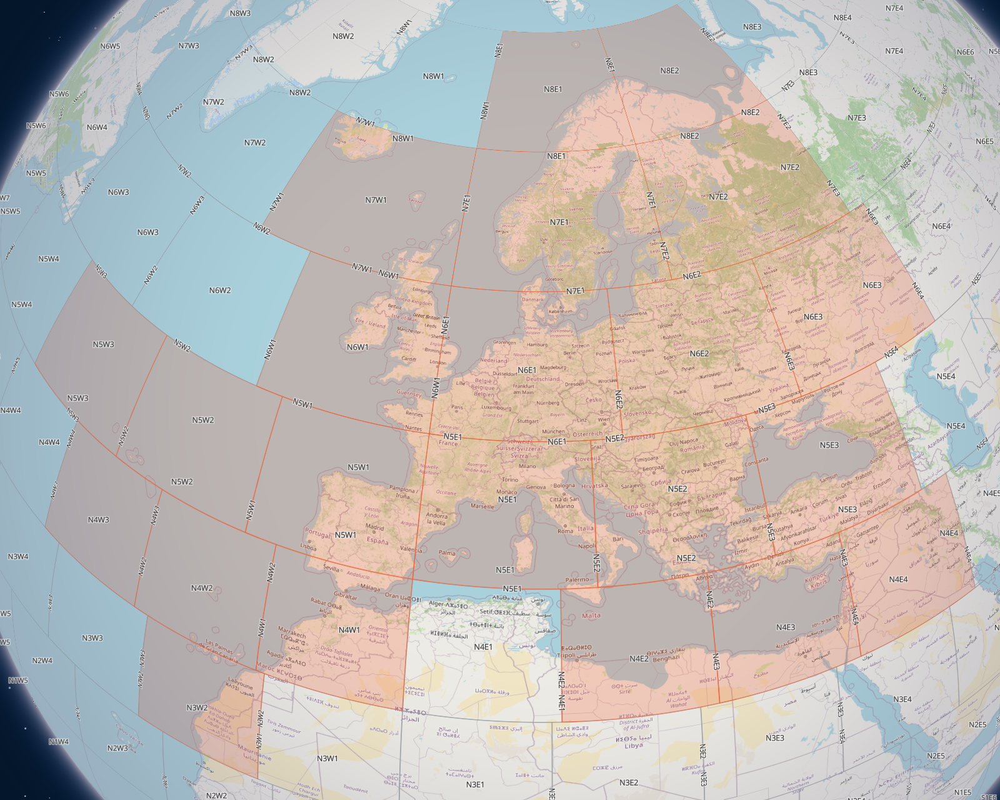

# Introduction

This conversion project allows you to update maps for your `Nissan Connect 3` navigation system with the data converted from `Open Street Maps` project.

All I describe here is based on the `NISSAN Connect LCN3 V7 2022_2023` SD Card image. It is version 7 (the last one) of the map targetting Europe (from year 2022) and the following cars:

- JUKE 2015 - 2017
- MICRA 2016 - 2018
- NAVARA 2015 - 2018
- NOTE 2015 - 2018
- PULSAR 2014 - 2018
- QASHQAI 2014 - 2018
- TIIDA 2014 - 2017
- X-TRAIL 2015 - 2018
- JUKE 2014 NISSAN CONNECT 3
- LEAF 2017 - 2018 CONNECT 3
- MICRA 2015 NISSAN CONNECT 3
- NAVARA 2015 NISSAN CONNECT 3
- QASHQAI 2013 NISSAN CONNECT 3
- X-TRAIL 2014 NISSAN CONNECT 3

To use this converter you must have an (original) copy of such SD Card, because the converter generates only some of the required files to be overriden. It is possible that other version of the SD card may work also, especially if the data format hasn't changed, but I haven't tested it.

The other requirement is that you have to copy the SD Card content to another one for which you can change its CID number to the same as in the original one. Most common SD Cards do not allow to change their CID numbers.

## Protections

- the navigation system verifies CID number of the SD Card, so you have to find a way to copy your CID number to a new SD Card
- some manifest files are signed (they include list of supported regions), but it is unclear if that is enforced to limit region data possible to replace, the data itself is not encrypted and at least Europe version of the SD card allows us to replace Europe data

## Disclaimer

This project is an independent research initiative created for personal interoperability purposes. It does not contain any proprietary map data, binaries, or copyrighted material belonging to Bosch, Nissan, or HERE. All the knowledge comes from reverse-engineering techniques, which was the only way to make the updates possible as the system is not supported anymore.

## Acknowledgments

This project would not be possible if not a hard work of other people:

- https://richard.burtons.org/2021/04/26/allowing-map-modifications-on-nissan-connect/, https://github.com/sapphire-bt/lcn2kai-decompress
- forums: https://www.qashqaiforums.co.uk/, https://www.navitotal.com/

# SD Card folders

## MAP files

Location: `CRYPTNAV/DATA/DATA/MAP` folder.

Map files are used to draw shapes on the screen (roads, build-up areas, grass, lakes). The data are used only for drawing shapes on the screen, not for navigation routing. The data on the original SD card covers 22 regions. You can see these regions and their names on the picture below: .

Generation of these files is working and is in the early testing phase. For usage see: [Usage](./doc/USAGE.md).

## RNW files

Location: `CRYPTNAV/DATA/DATA/RNW/CCP` folder.

Road navigation data is used to route navigation paths.

This part is still in the reverse engineering phase...
